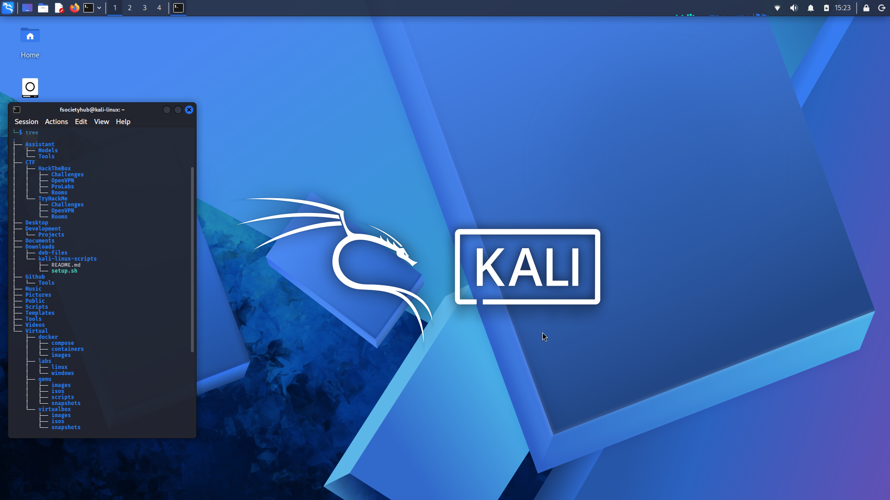
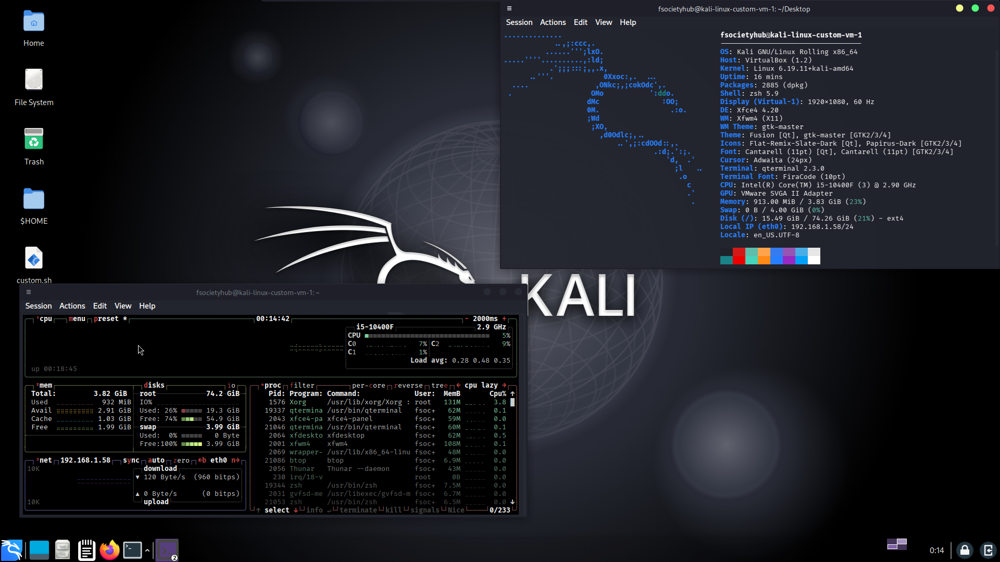

# Kali Linux Scripts


This repository contains Kali Linux scripts designed to automate the initial configuration and preparation of a Kali Linux environment for penetration testing, security research, and development.

## Post Installation Setup Script

``` bash
git clone https://github.com/fsocietygit/kali-linux-scripts.git
cd kali-linux-scripts
chmod +x setup.sh
./setup.sh
```


    
## Desktop Customization Script

``` bash
git clone https://github.com/fsocietygit/kali-linux-scripts.git
cd kali-linux-scripts
chmod +x custom.sh
./custom.sh
```




## License

This repository is provided as-is. Check the repository license file for details.